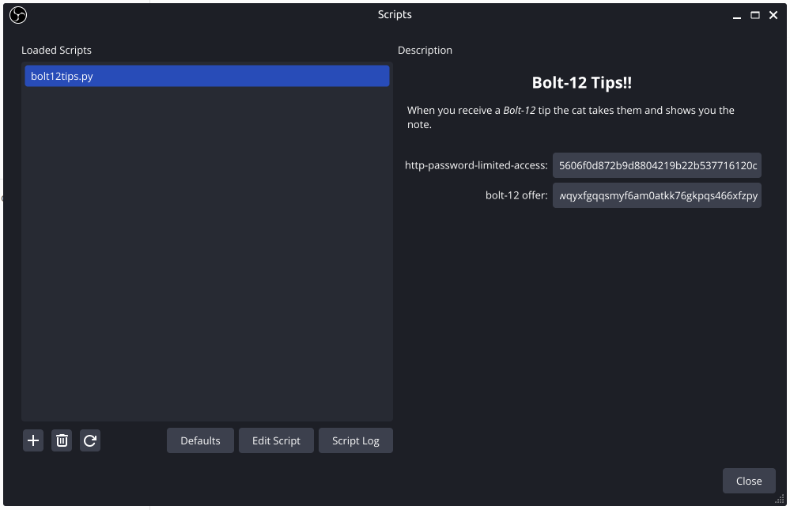
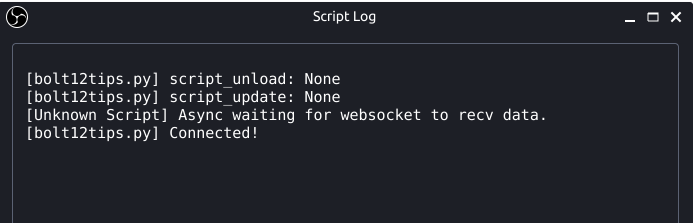

# Bolt12tips


This project demonstrates how to instantly receive a notification when you receive [Bitcoin](https://bitcoin.org/) tips while streaming using Lightning Bolt-12 payment codes.

You do not need to sign up with any 3rd party services to receive tips and can get started even if you do not currently have any Bitcoin. This project uses a [phoenixd](https://phoenix.acinq.co/server) Lightning server installed on the same machine you are streaming on to receive payments.

## How does it work?

You display a Bolt-12 QR code on your stream. When someone watching your stream scans the QR code with a Lightning wallet on their mobile phone, you receive a Bitcoin payment to your computer. When payments are received your stream will briefly show an alert (animated gif), play a sound (mp3) and show the amount of the tip and a note from the sender (if any).

## Prerequisite

### Install*

* [bolt12tips](https://github.com/bolt12tips/bolt12tips/releases/tag/1.0)
* [OBS Studio 28.x+](https://obsproject.com/download)
* [Python 3.11.9](https://www.python.org/ftp/python/3.11.9/python-3.11.9-amd64.exe)
* [phoenixd 0.3.4-jvm](https://github.com/ACINQ/phoenixd/releases) (Note: Windows must use the JVM version, but Linux/Mac OS can install native versions)
If using the JVM version of phoenixd:
* [Java Runtime JRE 61.0 or higher](https://adoptium.net/temurin/releases/?os=windows&arch=x64&package=jre) (Note: I suggest Adoptium Temurin JRE 21.0)

## Setup

### Setup Python

1. Unzip the `bolt12tips-1.0.zip` file to a directory of your choice.

2. install Python modules
```sh
python3 -m pip install --upgrade pip
python3 -m pip install qrcode asyncio esdk-obs-python websockets
```

### Setup OBS Studio

1. From OBS Studio go to `tools -> scripts`
2. Go to the `Python Settings` tab and select your Python installation
3. Go to the `Scripts` tab, select `Add Scripts` and select bolt12tips.py from the directory where you unzipped the `bolt12tips-1.0.zip` file.
4. Create and position the following scene items:
 - image called `cat`, display: hidden
 - text called `received`, display: hidden
 - image called `bolt12qrcode`, image: bolt12qrcode.png

### Run phoenixd
1. Go to the `bin` directory where you installed `phoenixd`
2. run `phoenixd.bat`
3. (first time) read and follow the installation instructions
4. (first time) write down the 12 recovery words and keep them safe
5. note the `lno...` bolt-12 static invoice

### Run the Script in OBS Studio
1. From OBS Studio go to `tools -> scripts`
2. select the `bolt12tips.py` script and run it.
3. select `show logs` and make sure you see `Connected!` and no error messages





DONE! you can now start streaming and receiving Bitcoin tips.

### FAQ

* How do I install Python so it works with OBS Studio?

See [How to Configure OBS to Run Python Scripts](https://learnscript.net/en/obs-python-scripting/setup/)

* How can I send bolt-12 tips? 

Install [Phoenix Wallet](https://phoenix.acinq.co/) on an Android or iOS phone, or see [bolt12.org](https://bolt12.org) for a current list of other implementations.

* How can I use my Bitcoin tips stored in `phoenixd`?

From the command line you can use the `phoenixd-cli --help` to see how you can send your funds to pay for goods from an online merchant or to your mobile Lightning wallet for in-person purchases.